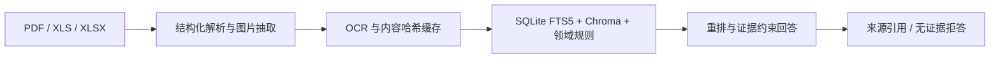

# 徐俊毅

**AI 应用开发 / Agent 工程方向 · 2027 届**  
温州理工学院 · 计算机科学与技术  
[xtyiyu84@gmail.com](mailto:xtyiyu84@gmail.com)

我关注的不是“接一个模型接口”，而是把真实业务流程拆成**可执行、可追踪、可人工接管**的 AI 工作流。

> 项目状态最后核验：**2026-07-28**  
> 以下项目源码、客户数据与业务配置保持私有；截图均使用脱敏合成数据。

## 01 · B2B SEO 内容生产工作流

从英文关键词出发，把 SERP 研究、选题与结构、行业写作、公司信息改写、配图计划和内容审核串成可复核流程；保存后的任务可由编辑二次确认创建 WordPress 草稿，**不会自动发布正式文章**。

当前管理台按真实交付记录生成客户消费总账，区分已计费、测试排除和无效记录；数据不可用时不展示可能误导的旧汇总。

`Python` · `LangGraph` · `React` · `Vite` · `WordPress REST API` · `Docker` · `Nginx`

**我负责：** 工作流编排、客户隔离、发布安全门禁、交付计费口径、管理台与部署验证。  
**当前边界：** 私有业务项目；公开图为当前界面的合成数据演示，不公开客户、文章、提示词与运行配置。

## 02 · 询盘背调助手

Windows 桌面多客户 Relay。它从 Google Sheets 领取同一客户的 1–5 条询盘，通过真实 Chrome / Edge CDP 会话调用 ChatGPT 网页搜索，再按客户、任务、Sheet 行号与源行指纹校验回复并逐行写回。

当前版本 **v0.3.19** 使用全局串行队列和滚动 24 小时会话；发送结果不确定、Sheet 写入失败或批量身份不一致时会停止自动重发并进入人工暂停，优先避免重复背调、错写 Sheet 和重复邮件。

`Python` · `FastAPI` · `Playwright / CDP` · `Google Sheets` · `Apps Script` · `PyInstaller`

**我负责：** 桌面端、浏览器 Relay、批次身份校验、失败关闭与恢复、监控台、Windows 构建交付。  
**当前边界：** 使用 ChatGPT 网页端而非 OpenAI API；公开图不含真实客户、询盘、Sheet ID、收件人或提示词；Windows 制品当前未做代码签名。

## 03 · 工业图文 RAG 原型

面向 PDF、XLS 与 XLSX 工业资料的本地知识库原型：结构化解析文档与 PFMEA 表格，抽取图片并执行 OCR，通过 SQLite FTS5、向量检索与领域规则进行召回和重排，回答时保留文件、页码、Sheet、行或图片来源，并为无证据问题设置拒答路径。

`Python` · `Streamlit` · `SQLite FTS5` · `Chroma` · `OCR` · `LLM`

**我负责：** 摄取管线、OCR 缓存、混合检索、证据引用、拒答与分维度评估。  
**当前边界：** 本地原型可读取当前资料库，但本次核验时 Chroma 向量索引尚未构建；完整测试在当前 Python 3.13 环境受依赖兼容性阻塞，因此不宣称生产可用或整体准确率。

## 工程取向

- 用明确状态、身份校验和失败关闭处理 AI 自动化的不确定性。
- 把人工审核留在发布、外发、写回和恢复等高风险边界。
- 区分本地测试、真实运行和线上验证，不用局部通过替代生产结论。
