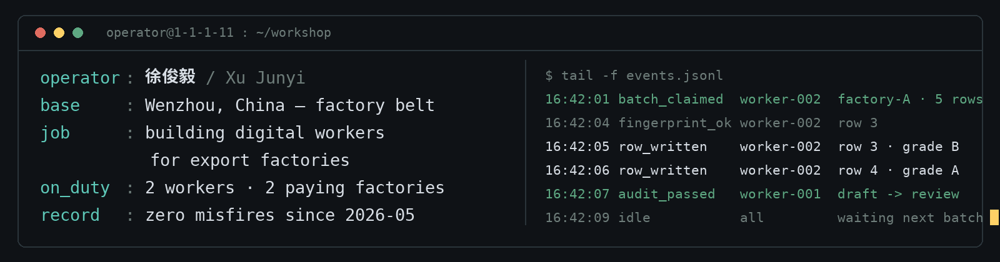

我是徐俊毅,温州人。这里的工厂把电机和鞋卖到全世界,我给这些工厂造数字员工——它们读询盘、写背调、起草英文内容,人只在最后点个头。目前有两只在岗,服务两家付费工厂,至今零错发。

**在岗员工**

`001` [**seo-content-workflow-demo**](https://github.com/1-1-1-11/seo-content-workflow-demo) · 内容工——吃进一个英文关键词,吐出一篇能过审的草稿;审不过,不发。

`002` [**lead-verification-relay-demo**](https://github.com/1-1-1-11/lead-verification-relay-demo) · 背调工——每条询盘验明正身(指纹)才准写回;认不出,就停工叫人。

`003` [**RAG**](https://github.com/1-1-1-11/RAG) · 资料工——翻工业 PDF 和 Excel,找不到证据就拒答,不编。

**车间规矩**

发邮件、写表格、点发布之前,必须叫人来看一眼。拿不准的第一反应是停下来,不是重试。测试没跑过的,不叫做完。

**下班以后**

五子棋 AI 校赛第一 · RAICOM 机器人省一 · 最近在折腾 [WeChatBot](https://github.com/1-1-1-11/WeChatBot) 和 [snake-ai](https://github.com/1-1-1-11/snake-ai)

---

温州理工学院 · 计算机科学与技术(2027 届) · 求职方向:AI Agent 应用开发工程师 · [xtyiyu84@gmail.com](mailto:xtyiyu84@gmail.com)
