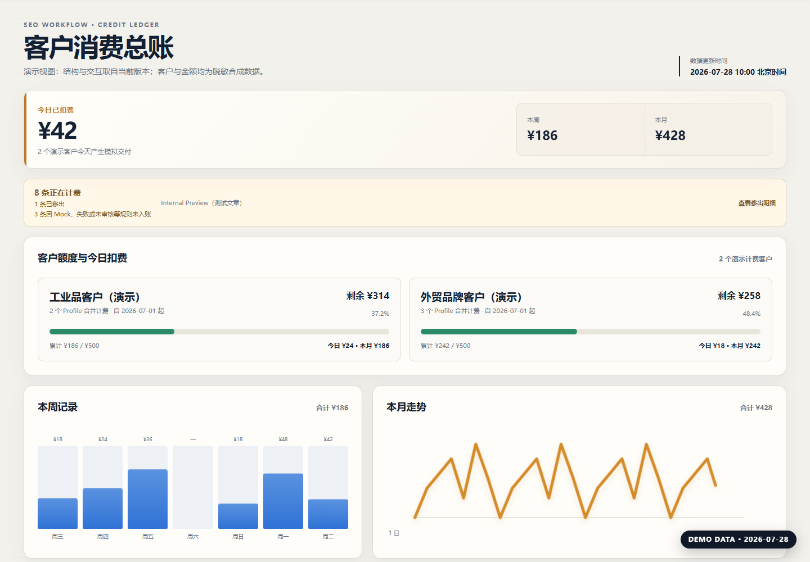
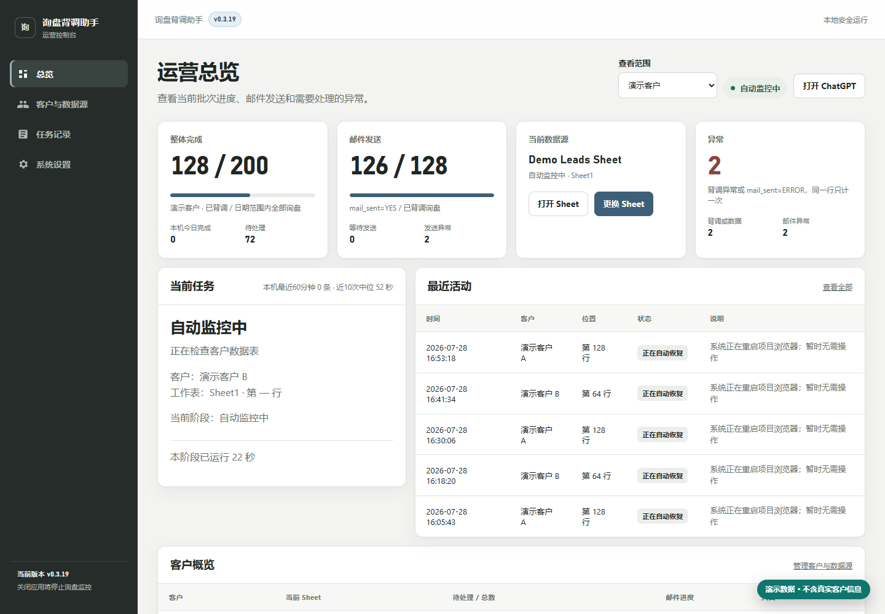
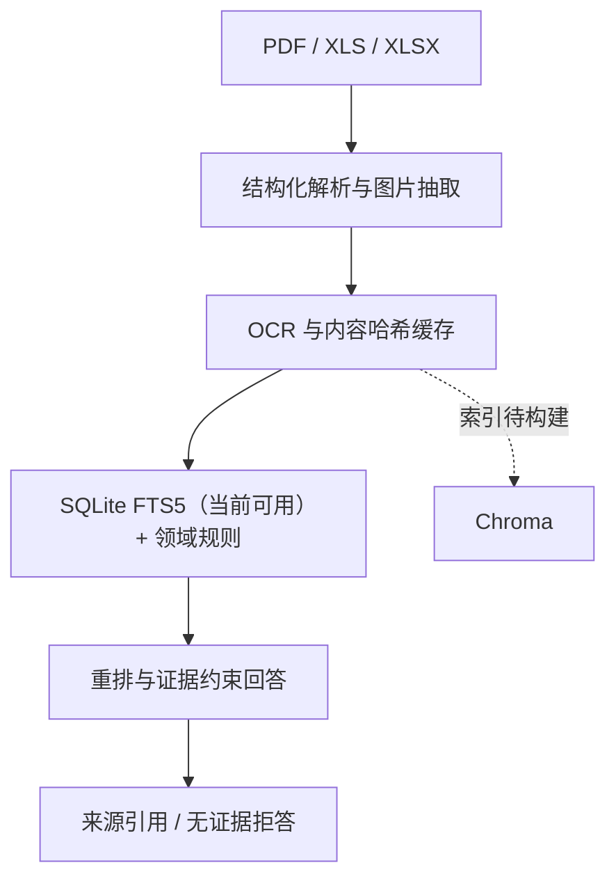

# 徐俊毅

**AI 应用开发 / Agent 工程方向 · 2027 届**  
温州理工学院 · 计算机科学与技术  
[xtyiyu84@gmail.com](mailto:xtyiyu84@gmail.com)

我关注的不是“接一个模型接口”，而是把真实业务流程拆成**可执行、可追踪、可人工接管**的 AI 工作流。

> 项目状态最后核验：**2026-07-28**  
> 以下项目源码、客户数据与业务配置保持私有；截图均使用脱敏合成数据。
> 本仓库只展示产品界面与当前事实边界，不是可运行源码仓库。

| 项目 | 当前状态 | 核心价值 |
|---|---|---|
| B2B SEO 工作流 | 客户交付版 | 从调研到 WordPress 草稿，保留人工审核 |
| 询盘背调助手 | Windows 交付版 v0.3.19 | 批量背调、安全写回与异常人工接管 |
| 工业图文 RAG | 本地验证原型 | PDF / Excel 检索、来源引用与无证据拒答 |

## 01 · B2B SEO 内容生产工作流

从英文关键词出发，把 SERP 研究、选题与结构、行业写作、公司信息改写、配图计划和内容审核串成可复核流程；保存后的任务可由编辑二次确认创建 WordPress 草稿，**不会自动发布正式文章**。

当前管理台按通过既定计费规则的任务记录汇总客户消费，区分已计费、测试排除和无效记录；该记录不等同于 WordPress 正式发布，数据不可用时也不展示可能误导的旧汇总。

_界面结构取自当前版本；图中客户、金额、数量与时间均为合成演示，不代表真实收入或实际处理量。_

`Python` · `LangGraph` · `React` · `Vite` · `WordPress REST API` · `Docker` · `Nginx`

**我负责：** 工作流编排、客户级配置与交付数据分区（非成熟多租户 SaaS）、发布安全门禁、交付计费口径、管理台与部署验证。

**当前边界：** 私有业务项目；公开图为当前界面的合成数据演示，不公开客户、文章、提示词与运行配置。

## 02 · 询盘背调助手

Windows 桌面多客户 Relay。它从 Google Sheets 领取同一客户的 1–5 条询盘，通过真实 Chrome / Edge CDP 会话调用 ChatGPT 网页搜索，再按客户、任务、Sheet 行号与源行指纹校验回复并逐行写回。

当前版本 **v0.3.19** 使用全局串行队列和滚动 24 小时会话；发送结果不确定、Sheet 写入失败或批量身份不一致时会停止自动重发并进入人工暂停，优先避免重复背调、错写 Sheet 和重复邮件。

浏览器失联等未发送故障可以自动恢复；只有可能造成重复发送或错写数据的故障才进入人工暂停。

_界面取自当前 v0.3.19 运行程序；客户、Sheet 名、数量、行号与时间均已替换为演示值。_

`Python` · `FastAPI` · `Playwright / CDP` · `Google Sheets` · `Apps Script` · `PyInstaller`

**我负责：** 桌面端、浏览器 Relay、批次身份校验、失败关闭与恢复、监控台、Windows 构建交付。  
**当前边界：** 使用 ChatGPT 网页端而非 OpenAI API；公开图不含真实客户、询盘、Sheet ID、收件人或提示词；Windows 制品当前未做代码签名。

## 03 · 工业图文 RAG 原型

面向 PDF、XLS 与 XLSX 工业资料的本地知识库原型。当前已完成文档与 PFMEA 表格解析、图片抽取、OCR、SQLite FTS5 检索和来源引用，并为无证据问题设置拒答路径；Chroma 接口已经接入，但本次核验时索引条目为 0，尚未验证向量召回链路。

`Python` · `Streamlit` · `SQLite FTS5` · `Chroma` · `OCR` · `LLM`

**我负责：** 摄取管线、OCR 缓存、混合检索、证据引用、拒答与分维度评估。  
**当前边界：** 当前 Python 3.13 环境执行 16 项测试：8 项通过，8 项因 `xlrd` / `chromadb` 依赖缺失或兼容性问题失败，未验证部分不计为通过；因此不宣称生产可用或整体准确率。

## 工程取向

- 用明确状态、身份校验和失败关闭处理 AI 自动化的不确定性。
- 把人工审核留在发布、外发、写回和恢复等高风险边界。
- 区分本地测试、真实运行和线上验证，不用局部通过替代生产结论。
