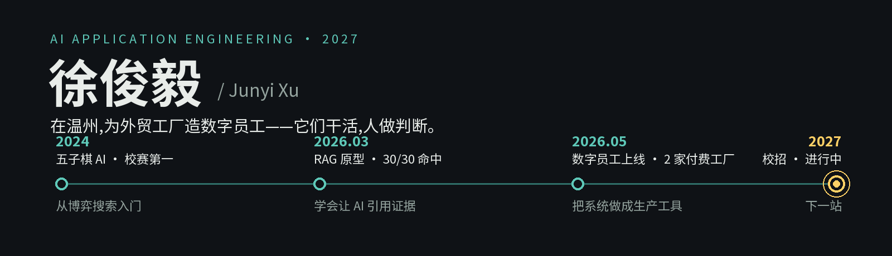

我是徐俊毅,温州人,2027 届计算机本科。
这里的工厂把电机和鞋卖到全世界,我给这些工厂造数字员工:它们读询盘、写背调、起草英文内容,人只在最后点个头。目前两只在岗,服务两家付费工厂,至今零错发。

## 我是什么样的人

- **主动沟通,大方表达。** 从对外贸一无所知,到蹲进业务流程里问清楚再动手——先理解人,再写代码。做出来的东西,我敢当场演示给你看。
- **定了目标,就一步步落实。** 五子棋 AI → RAG 原型 → 上线的 Agent 系统,每个项目都是下一个项目的地基,没有一步是白走的。
- **遇到困难不逃。** 2 GB 内存的服务器,调 Docker 和内存参数把工作流跑稳;系统出过真实故障,所以把它设计成"宁可停,不可错"。
- **追求上限,不保下限。** 能跑不算完:436 个 pytest 用例、红绿 TDD、p95 延迟实测。交出去的东西,做到我当前能力的最好。
- **无限游戏心态。** 不比一次输赢,比能力复利——每个项目沉淀下来的模式,都变成下一个项目的起点。

## 能力面

| 方向 | 具体 |
|---|---|
| Agent 与大模型应用 | LangGraph 多智能体编排、RAG(混合检索、来源引用)、Prompt 工程、任务编排与故障恢复 |
| 后端与自动化 | Python(异步)、FastAPI、Playwright / CDP 浏览器自动化、Streamlit、Pydantic v2 |
| 数据与集成 | SQLite FTS5、Chroma、openpyxl、Google Sheets API、Apps Script |
| 工程与交付 | Docker / Compose、GitHub Actions CI/CD、pytest(TDD)、PyInstaller / MSIX、Linux 排障、Nginx |

## 证据

- [**seo-content-workflow-demo**](https://github.com/1-1-1-11/seo-content-workflow-demo) — LangGraph 多智能体内容流水线,生产系统脱敏重写版,mock 模式免 Key 可跑
- [**lead-verification-relay-demo**](https://github.com/1-1-1-11/lead-verification-relay-demo) — 询盘背调 Relay 的安全模式:四重身份校验、全局人工暂停、写回列白名单
- [**RAG**](https://github.com/1-1-1-11/RAG) — 工业图文 RAG 原型,FTS5 + Chroma 混合检索,来源引用可回溯

## 经历与荣誉

**联界智能科技有限公司** · AI Agent 开发实习生(2026.05 – 至今)——独立交付 3 个已上线的业务 Agent 系统

RAICOM 机器人大赛省一等奖 · 校程序设计竞赛三等奖 · 校五子棋 AI 竞赛第 1 名 · 校级三等奖学金 · 软考中级软件设计师 · CET-6(494)

---

📮 [xtyiyu84@gmail.com](mailto:xtyiyu84@gmail.com) · 求职方向:AI Agent 应用开发工程师
