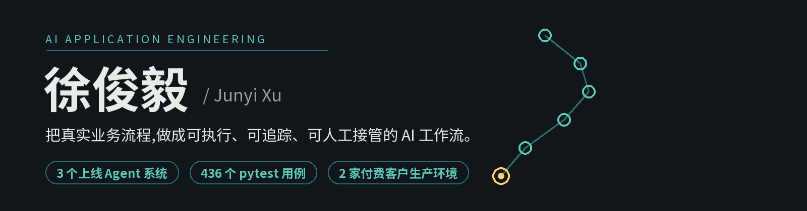

温州理工学院 · 计算机科学与技术(2027 届)&nbsp;&nbsp;·&nbsp;&nbsp;求职方向:AI Agent 应用开发工程师

## 开源作品

| 项目 | 是什么 | 技术 |
|---|---|---|
| [**seo-content-workflow-demo**](https://github.com/1-1-1-11/seo-content-workflow-demo) | LangGraph 多智能体 SEO 内容流水线——生产系统的脱敏重写版,mock 模式免 Key 可跑,全链路产物可复核 | `LangGraph` `Pydantic` `pytest` |
| [**lead-verification-relay-demo**](https://github.com/1-1-1-11/lead-verification-relay-demo) | 多客户询盘背调 Relay 的安全模式演示——四重身份校验、全局人工暂停、写回列白名单,含篡改攻击演示脚本 | `FastAPI` `async` `pytest` |
| [**RAG**](https://github.com/1-1-1-11/RAG) | 工业图文 RAG 原型——FTS5 + Chroma 混合检索,来源引用可回溯到 PDF 页码 / Excel 行列 | `SQLite FTS5` `Chroma` `OCR` |

## 生产实践 · 实习(2026.05 至今)

- **LangGraph 8 节点内容流水线**(已上线):SERP 研究 → 品牌改写 → 硬性审核 → 人工确认发布,单篇初稿由半天至 1 天缩短至约 10 分钟
- **询盘智能背调 Relay**(服务 2 家付费客户生产环境):批次身份 + 源行指纹逐行校验,异常即全局人工暂停,单条处理由约 30 分钟缩短至约 1 分钟
- **交付与质量**:全程 TDD,436 个 pytest 用例;Docker Compose 多客户部署,单次接入由约 2 天缩短至 1 小时;PyInstaller/MSIX 桌面打包,GitHub Actions 私有 Release

## 工程取向

- 用明确状态、身份校验和失败关闭,处理 AI 自动化的不确定性
- 把人工审核留在发布、外发、写回、恢复等高风险边界
- 区分本地测试、真实运行与线上验证,不用局部通过冒充生产结论

---

📮 [xtyiyu84@gmail.com](mailto:xtyiyu84@gmail.com)
